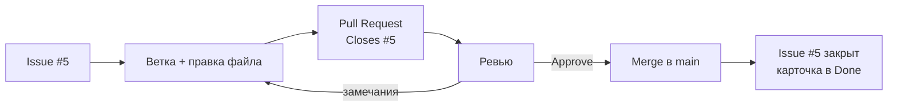

# Как сделать Pull Request в веб-интерфейсе GitHub

Эта инструкция показывает один Pull Request (PR) от начала до конца, без терминала и Git на компьютере. Всё делается в браузере.

**Пример:** задача **#5 «Составить реестр стейкхолдеров и матрицу влияния и интереса»**. Автор: Анна (@anna-s), ревьюер: Иван (@ivan-p). Файл: `docs/stakeholders.md`.

Общая схема:



Названия кнопок в интерфейсе GitHub иногда меняются. Если кнопка выглядит немного иначе, ищите её по смыслу.

---

## Шаг 1. Возьмите задачу в работу

1. Откройте вкладку **Issues** и найдите задачу **#5**.
2. В правой колонке, в блоке **Assignees**, нажмите **assign yourself**.
3. Откройте доску проекта (вкладка **Projects**) и перетащите карточку #5 из `To Do` в `In Progress`.

Теперь команда видит, кто занимается задачей.

---

## Шаг 2. Откройте файл и внесите правки

1. Перейдите на вкладку **Code** и откройте `docs/stakeholders.md`.
2. Нажмите на значок карандаша **Edit this file** справа над содержимым файла.
3. Внесите изменения: заполните реестр, матрицу и RACI.
4. Переключитесь на вкладку **Preview** вверху редактора. Проверьте, что таблицы отображаются как таблицы, а диаграмма Mermaid рисуется. Если вместо диаграммы ошибка, вернитесь во вкладку **Edit** и исправьте синтаксис.

Большой документ удобнее писать частями. Можно сделать несколько коммитов в одну ветку (см. шаг 3 и шаг 7).

---

## Шаг 3. Сохраните правки в новую ветку

1. Нажмите зелёную кнопку **Commit changes...** справа вверху.
2. В открывшемся окне заполните поля:
   - **Commit message:** `docs: add stakeholder register (#5)`
   - **Extended description** (необязательно): `Реестр из 9 стейкхолдеров и матрица влияния и интереса`
3. Выберите вариант **Create a new branch for this commit and start a pull request**.
4. Укажите имя ветки: `docs/5-stakeholders`. Схема имени: `тип/номер-задачи-кратко`.
5. Нажмите **Propose changes**.

Если включена защита ветки `main`, вариант «Commit directly to the main branch» будет недоступен. Так и задумано: в `main` попадают только изменения через PR.

---

## Шаг 4. Оформите Pull Request

GitHub откроет страницу **Open a pull request**. Сверху показано, что ветка `docs/5-stakeholders` будет влита в `main`.

1. **Заголовок (Add a title):** `Реестр стейкхолдеров и матрица влияния и интереса`
2. **Описание (Add a description).** Шаблон PR подставится сам. Заполните его:

   ```markdown
   ## Что сделано
   - Реестр из 9 стейкхолдеров с оценкой влияния и интереса
   - Матрица влияния и интереса (Mermaid)
   - Стратегия работы с каждой группой

   ## Задача
   Closes #5

   ## Проверено
   - [x] Выполнены критерии готовности из задачи
   - [x] Нет пустых разделов и пометок TODO, проверена орфография
   - [x] Есть ссылки на источники
   ```

   Строка `Closes #5` обязательна. Когда PR будет влит в `main`, GitHub сам закроет задачу #5.

3. **Правая колонка:**
   - **Reviewers:** выберите @ivan-p. Ревьюер получит уведомление.
   - **Assignees:** нажмите **assign yourself**.
   - **Labels:** `docs`.
   - **Projects:** выберите доску вашей группы (необязательно, задача #5 там уже есть).
   - **Milestone:** `ЛР1: Инициация`.
4. Нажмите **Create pull request**.

   Если работа ещё не готова к проверке, откройте выпадающее меню у этой кнопки и выберите **Create draft pull request**. Позже нажмёте **Ready for review**.

5. Проверьте блок **Development** в правой колонке PR: там должна появиться задача #5. Это значит, что связь работает.
6. На доске перенесите карточку #5 в `In Review`.

Внизу PR появится результат автопроверки `lab1-check`. Предупреждения в ней не мешают слиянию, но их стоит прочитать.

---

## Шаг 5. Ревью (делает Иван)

1. Иван открывает вкладку **Pull requests** и выбирает PR. Ещё быстрее перейти по ссылке из уведомления.
2. На вкладке **Conversation** он читает описание и проверяет, что указано `Closes #5`.
3. Затем переходит на вкладку **Files changed**. Зелёным выделены добавленные строки, красным удалённые.
   - Чтобы увидеть документ целиком в оформленном виде, нажмите значок **Display the rich diff** (или **...** → **View file**).
4. **Комментарий к строке.** Наведите курсор на строку, нажмите синий **+** слева, напишите замечание, например:
   > «Не хватает Водоканала: он влияет на размещение новых точек. Добавь, пожалуйста».

   Нажмите **Start a review**. Комментарий пока виден только вам. Так можно собрать все замечания и отправить их одним пакетом.
5. **Предложение исправления.** В окне комментария есть кнопка **Add a suggestion** (значок с плюсом и минусом). Она вставляет строку, которую можно исправить прямо в комментарии. Автор сможет принять правку одной кнопкой.
6. Когда всё просмотрено, нажмите **Submit review** (или **Review changes**) справа вверху и выберите вариант:
   - **Comment** — общий комментарий без решения;
   - **Request changes** — нужны исправления, PR пока не сливаем;
   - **Approve** — всё в порядке.

   В нашем примере Иван выбирает **Request changes** и пишет короткий итог: «В целом хорошо, добавь Водоканал и проверь оценки интереса».

Свой PR одобрить нельзя: кнопка Approve для автора недоступна. Поэтому ревьюер всегда другой человек.

---

## Шаг 6. Исправьте замечания (делает Анна)

Анне приходит уведомление. Она открывает PR и видит замечания на вкладке **Conversation**.

**Если ревьюер предложил исправление (suggestion):**
1. Нажмите **Commit suggestion** под комментарием (или **Add suggestion to batch**, чтобы принять несколько сразу).
2. Подтвердите коммит. Правка сразу попадёт в ветку PR.

**Если нужно исправить файл самостоятельно:**
1. Перейдите на вкладку **Files changed**.
2. У файла `docs/stakeholders.md` нажмите **...** справа → **Edit file**. Откроется редактор уже на ветке `docs/5-stakeholders`, не на `main`.
3. Внесите правки и нажмите **Commit changes...**.
4. Сообщение: `docs: add Vodokanal to stakeholders (#5)`.
5. Оставьте вариант **Commit directly to the docs/5-stakeholders branch**. Новую ветку создавать не нужно.
6. Нажмите **Commit changes**.

Затем:
- ответьте на комментарий ревьюера («Добавила, см. строку 12») и нажмите **Resolve conversation**;
- в блоке **Reviewers** нажмите значок со стрелками рядом с именем Ивана (**Re-request review**), чтобы он посмотрел ещё раз.

---

## Шаг 7. Повторное ревью

Иван открывает PR. GitHub показывает, какие изменения появились после его прошлого ревью. Он проверяет исправления, нажимает **Submit review** → **Approve** и пишет: «Теперь всё хорошо».

---

## Шаг 8. Слияние (merge)

Сливает PR его автор или менеджер проекта. Договоритесь об этом в командном договоре.

1. Внизу вкладки **Conversation** убедитесь, что есть одобрение (Approved) и проверки прошли.
2. Откройте выпадающее меню у зелёной кнопки слияния и выберите **Squash and merge**. Все промежуточные коммиты PR превратятся в один аккуратный коммит в `main`.
3. Проверьте сообщение коммита (по умолчанию это заголовок PR с номером, например `Реестр стейкхолдеров и матрица влияния и интереса (#14)`). Нажмите **Confirm squash and merge**.
4. Нажмите **Delete branch**. Ветка больше не нужна, а история изменений сохранится в PR.

---

## Шаг 9. Проверьте результат

- Задача **#5** закрыта, в ней есть ссылка на PR (сработало `Closes #5`).
- Карточка #5 на доске в `Done`. Если не переместилась сама, включите в настройках доски автоматизацию **Item closed → Done** (Projects → **...** → **Workflows**) или перенесите вручную.
- В `main` лежит обновлённый `docs/stakeholders.md`.
- В истории PR видны правки, замечания и одобрение. Это и есть прослеживаемость, которую оценивает преподаватель.

---

## Способ 2: начать с ветки из задачи

Ветку можно создать прямо из задачи. Тогда она сразу будет связана с Issue.

1. Откройте задачу #5 и в правой колонке, в блоке **Development**, нажмите **Create a branch**.
2. Имя ветки GitHub предложит сам (например, `5-составить-реестр-стейкхолдеров...`). Сократите его до `docs/5-stakeholders` и нажмите **Create branch**.
3. На вкладке **Code** в переключателе веток (слева вверху, где написано `main`) выберите `docs/5-stakeholders`.
4. Отредактируйте файл и сохраните с вариантом **Commit directly to the docs/5-stakeholders branch**.
5. Вверху репозитория появится жёлтая плашка **Compare & pull request**. Нажмите её и дальше действуйте с шага 4.

---

## Частые ошибки

| Ошибка | Как исправить |
|---|---|
| Правка сделана прямо в `main` | Включите защиту ветки (Settings → Rules) и в следующий раз выбирайте «Create a new branch» |
| Задача не закрылась после слияния | В описании PR нет `Closes #N`, есть опечатка или PR влит не в `main` |
| Исправление замечаний создало второй PR | При правке на вкладке Files changed выбирайте «Commit directly to the <ваша ветка> branch» |
| Ревьюер не видит PR | Его не добавили в Reviewers, или он не Collaborator репозитория |
| Таблица в Markdown отображается одной строкой | Перед таблицей нужна пустая строка, а число столбцов во всех строках должно совпадать |
| Все PR сливаются в последний вечер | Делайте небольшие PR по одной задаче и сливайте по мере готовности |
