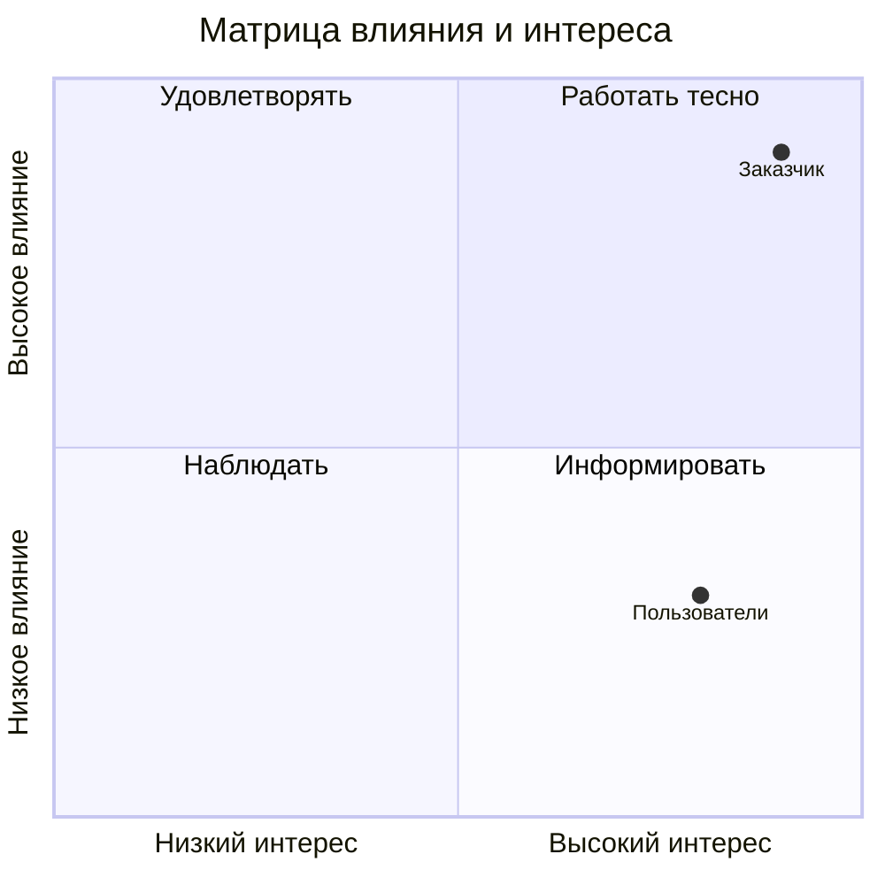

# Стейкхолдеры, матрица влияния и интереса, RACI

<!-- TODO: шаг 4 задания ЛР 1. Минимум 8 стейкхолдеров и 8 работ в RACI. -->

## Реестр
| Стейкхолдер | Роль | Что ожидает | Влияние (1–5) | Интерес (1–5) | Как работаем |
|---|---|---|---|---|---|
| | | | | | |

## Матрица влияния и интереса
Координаты по осям от 0 до 1. Замените примеры своими стейкхолдерами.

## RACI
В каждой строке ровно одна буква A.

| Работа | Менеджер проекта | Аналитик | Тех. организатор | Заказчик |
|---|---|---|---|---|
| Устав проекта | | | | |
| | | | | |

## Интервью с заказчиком
Протокол: [docs/meetings/](meetings/)
