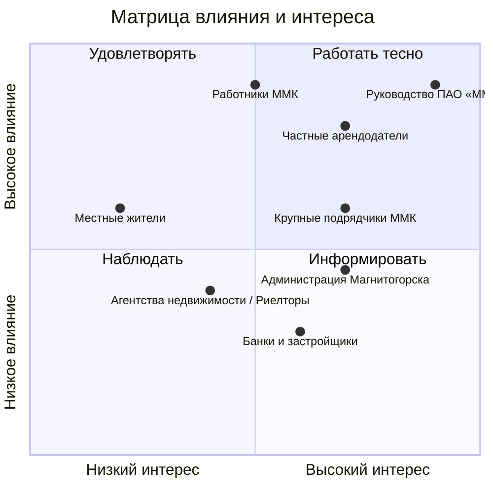

# Стейкхолдеры, матрица влияния и интереса, RACI

## Реестр

| Стейкхолдер | Роль | Что ожидает | Влияние (1–5) | Интерес (1–5) | Как работаем |
|---|---|---|---|---|---|
| **Руководство ПАО «ММК»** | Главный заказчик и спонсор спроса | Быстрое заселение сотрудников, удержание кадров, прозрачные отчетные документы, адекватные цены | **5** | **5** | **Плотное партнерство:** Заключаем долгосрочные соглашения, предоставляем полный пакет закрывающих документов |
| **Частные арендодатели (собственники)** | Поставщики жилого фонда | Своевременная оплата, сохранность имущества, отсутствие проблем с соседями, долгосрочная аренда без простоев | **4** | **5** | **Управление ожиданиями:** Заключаем жесткие договоры с прописанной материальной ответственностью, берем залог, гарантируем стабильный пул арендаторов |
| **Работники ММК (приезжие/кадры)** | Конечные потребители | Комфортные условия, близость к транспорту до промплощадки, адекватный хозяин, невысокая стоимость | **3** | **5** | **Максимальный сервис:** Оперативно решаем бытовые проблемы, подбираем жилье под семейные нужды (сады, школы) |
| **Крупные подрядчики ММК** | Оптовые конкуренты/клиенты | Быстрое расселение больших бригад (сезонных рабочих), минимальная цена за койко-место, гибкие сроки аренды | **4** | **4** | **Сотрудничество/конкуренция:** Предлагаем им специализированный фонд (многокомнатные квартиры, хостелы), чтобы они не вымывали квартиры для топ-кадров |
| **Агентства недвижимости / Риелторы** | Посредники и эксперты рынка | Получение своей комиссии, эксклюзивные базы объектов, быстрая прокрутка сделок без юридических рисков | **3** | **4** | **Взаимовыгодный обмен:** Привлекаем для быстрого поиска дефицитных вариантов, делимся комиссией за качественный подбор объектов |
| **Местные жители** | Сторонняя затронутая среда | Сохранение доступных цен на аренду в городе, отсутствие «шумных соседей-вахтовиков» в подъездах | **2** | **3** | **Мониторинг и комплаенс:** Отслеживаем социальное недовольство, жестко контролируем соблюдение правил тишины жильцами-сотрудниками |
| **Администрация Магнитогорска** | Регулятор городской среды | Легализация рынка аренды (налоги), отсутствие социальных конфликтов, привлечение специалистов в регион | **3** | **2** | **Информирование и легитимность:** Работаем строго «в белую» (самозанятость, ИП, НДФЛ), поддерживаем городские стандарты благоустройства |
| **Банки и застройщики** | Альтернативные поставщики жилья | Привлечение работников ММК в ипотечные программы, продажа новостроек, продвижение совместных с ММК льготных кредитов | **4** | **4** | **Мониторинг альтернатив:** Отслеживаем условия по ипотеке для сотрудников ММК. Корректируем стоимость аренды так, чтобы ежемесячный платеж за съемное жилье оставался выгоднее или доступнее ипотечного взноса |

## Матрица влияния и интереса

## RACI

| Работа | Менеджер проекта | Аналитик | Тех. организатор | Заказчик |
|---|---|---|---|---|
| Ведение репозитория | C | I | A | R |
| Анализ ситуации | C | A | R | I |
| Постановка целей | A | C | I | C |
| Подбор критериев успеха | A | C | I | C |
| Устав проекта | A | R | I | C |
| Поиск стейкхолдеров | R | A | I | C |
| Определение границ, срока, бюджета и рисков | A | R | C | C |
| Выбор подхода к управлению | A | C | R | I |

## Интервью с заказчиком
Протокол: [docs/meetings/](meetings/)
