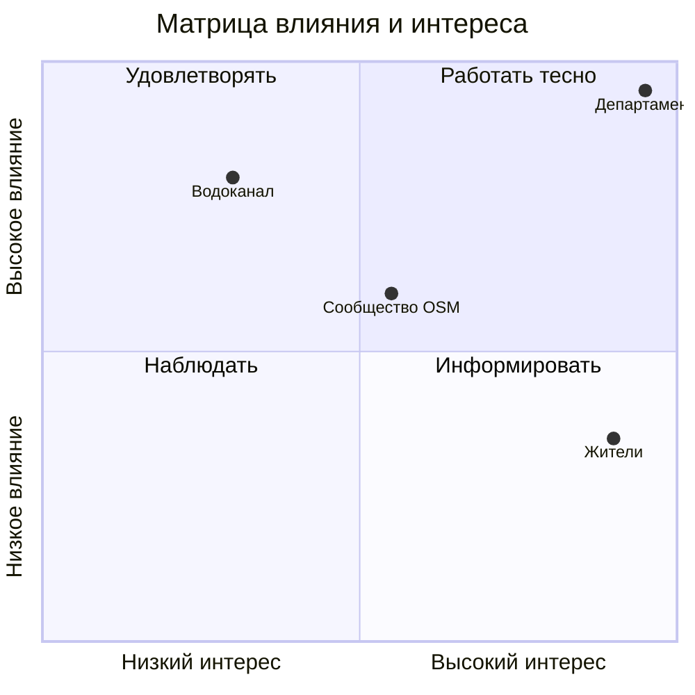

# Лабораторная работа №1
## Инициация проекта: зачем он нужен, кто в нём участвует и как мы будем им управлять

Дисциплина: Проектный менеджмент, 4 курс, IT-направления.
Формат: группа из 2–4 человек, один общий репозиторий на группу.
Время: около 4 академических часов на занятии и 2–3 часа самостоятельно.
Место в курсе: первая из шести сквозных работ. Всё, что вы сделаете здесь, понадобится дальше. В ЛР 2 вы возьмёте за основу устав проекта, а поиск и анализ данных начнётся там же.

---

## 1. О чём эта работа

Любой проект начинается не с кода и не с карты, а с вопроса: зачем он нужен и стоит ли им заниматься. В этой работе вы пройдёте фазу инициации так, как это делают в реальных IT-командах. Вы разберётесь, какую проблему решает ваш проект и для кого. Вы поставите измеримые цели, найдёте всех, кого проект затрагивает, и выберете подход к управлению. Затем вы соберёте всё это в короткий документ, устав проекта, и защитите его перед «спонсором». Спонсором будет преподаватель.

Параллельно вы настроите рабочую среду на GitHub. Задачи, документы и обсуждения будут жить там, поэтому через пять работ вы сможете показать полную историю проекта.

**К концу работы вы сможете:**
- сформулировать проблему проекта и поставить SMART-цели;
- выявить стейкхолдеров и распределить ответственность через RACI;
- написать устав проекта и обосновать выбор методологии;
- вести работу в GitHub: Issues, Milestones, доска проекта, Pull Requests.

---

## 2. Краткая справка

### Методология и термины

| Термин | Что это простыми словами |
|---|---|
| **Проект** | Работа с началом и концом, которая создаёт что-то уникальное: продукт, сервис, результат. Регулярная работа по расписанию проектом не является. |
| **Жизненный цикл проекта** | Путь от идеи до закрытия, разбитый на этапы. Бывает последовательным (водопад), итеративным (короткими циклами, Agile) или гибридным. |
| **PMBOK и ISO 21502** | Международные руководства по управлению проектами. Для нас это общий словарь и набор проверенных практик, а не жёсткая инструкция. |
| **Agile** | Подход, где продукт делают небольшими кусками, часто показывают заказчику и быстро меняют курс по обратной связи. |
| **Scrum** | Agile-фреймворк с короткими итерациями (спринтами), ролями (Product Owner, Scrum Master, команда) и ритуалами (планирование, ежедневная встреча, демонстрация, ретроспектива). |
| **Kanban** | Метод управления потоком задач на доске. Главная идея: ограничить число задач «в работе» (WIP), чтобы не начинать всё сразу. |
| **Гибридный подход** | Сочетание: например, бюджет и вехи планируются заранее, а продукт разрабатывается спринтами. Очень распространён в банках и крупных компаниях. |
| **Инициация** | Самая первая фаза: решаем, нужен ли проект, зачем, с какими целями и силами. На выходе устав и решение о старте. |
| **Бизнес-обоснование** | Короткий ответ на вопрос «зачем»: какая проблема, какие есть варианты решения, что получим и чем рискуем. |
| **Устав проекта (Project Charter)** | Документ на 3–5 страниц, который запускает проект и фиксирует цели, границы, вехи, бюджет, риски и команду. Это «конституция» проекта. |
| **SMART-цель** | Цель, которая конкретна (Specific), измерима (Measurable), достижима (Achievable), значима (Relevant) и ограничена по времени (Time-bound). |
| **Стейкхолдер** | Любой человек или организация, на кого проект влияет или кто влияет на проект: заказчик, пользователи, команда, регулятор, поставщики данных. |
| **Матрица влияния и интереса** | Способ разложить стейкхолдеров по двум осям и понять, с кем работать плотно, а кого просто информировать. |
| **RACI** | Таблица ответственности. R выполняет работу, A отвечает за результат (на одну работу только один A), C консультирует, I получает информацию. |
| **Допущение и ограничение** | Допущение: то, что мы принимаем за истину без проверки («данные будут доступны»). Ограничение: жёсткая рамка (срок, бюджет, размер команды). |
| **Риск** | Событие, которое может произойти и повлиять на проект. Удобная формула записи: «Если ..., то ...». |
| **MVP** | Минимально жизнеспособный продукт: самый маленький набор функций, который уже приносит пользу. |
| **Go / No-Go** | Решение спонсора по итогам инициации: запускаем, доработать или останавливаем. |
| **ADR** | Короткая запись принятого решения: контекст, выбор, альтернативы, последствия. Через полгода она ответит на вопрос «а почему мы так решили». |

### GitHub, который нам нужен

| Термин | Пояснение |
|---|---|
| **Репозиторий** | Папка проекта с историей всех изменений. |
| **Issue** | Задача с описанием, исполнителем и номером `#N`. |
| **Label** | Цветная метка для группировки задач. |
| **Milestone** | Этап с датой. У нас этап — это лабораторная работа или спринт. |
| **Project (доска)** | Канбан-доска и таблица поверх задач. Есть представления Board, Table и Roadmap. |
| **Ветка (branch)** | Параллельная копия, где вы вносите правки, не трогая основную ветку `main`. |
| **Pull Request (PR)** | Предложение влить вашу ветку в `main`. Коллеги смотрят изменения, комментируют и одобряют. |
| **`Closes #N`** | Фраза в описании PR. Когда PR сливается, задача `#N` закрывается сама. Так задачи, документы и результаты оказываются связаны. |

---

## 3. Учебный пример: AquaMap Ekaterinburg

Чтобы у вас был ориентир, весь текст ниже иллюстрируется одним вымышленным проектом. Он не входит в 12 ваших вариантов, поэтому его не нужно копировать. Достаточно повторить логику для своей темы.

> Департамент благоустройства города хочет, чтобы горожане и туристы легко находили питьевую воду на улице. Продукт: веб-карта фонтанчиков и питьевых кранов. Она должна показывать районы, где воды рядом нет, чтобы департамент мог планировать новые точки.

---

## 4. Как организовать работу группы

Распределите роли. На эту работу достаточно четырёх, в группе из двух-трёх человек их придётся совместить. В следующих лабораторных работах роли меняются, чтобы каждый попробовал себя менеджером.

| Роль | Чем занимается в ЛР 1 |
|---|---|
| Менеджер проекта | Следит за сроками, ведёт доску, собирает устав, ведёт защиту |
| Аналитик предметной области | Разбирает проблему, стейкхолдеров, проводит интервью |
| Технический организатор | Настраивает репозиторий и доску, помогает с Git |
| Руководитель рисков и решений | Ведёт реестр рисков и записи о принятых решениях (ADR) |

Три правила на весь курс:
1. **Нет Issue, нет работы.** Любая задача сначала заводится в трекере.
2. **Документы попадают в `main` через Pull Request.** Автор вносит правки, другой участник проверяет. Каждый в группе должен хотя бы раз побыть и автором, и ревьюером.
3. **Если использовали ИИ-ассистента, запишите это** в `docs/ai-usage.md`: что спрашивали, что получили, что исправили. Использовать ИИ можно и полезно, главное — проверять и понимать результат.

---

## 5. Пошаговое задание

Каждый шаг ниже устроен одинаково: что сделать, как это может выглядеть и что получится на выходе.

### Шаг 0. Познакомьтесь и договоритесь о правилах (15–20 минут)

Распределите роли, получите у преподавателя номер варианта и город или регион, с которым будете работать. Затем составьте короткий командный договор. Он нужен, чтобы через месяц не выяснять, кто должен был ответить на сообщение.

Что в нём должно быть: как вы общаетесь и как быстро отвечаете, когда проходят встречи, как проверяете работу друг друга, что считаете «готовым» документом и что делаете, если кто-то пропал.

**Пример.**
- Общаемся в Telegram, отвечаем в течение суток в будни.
- Встречаемся по вторникам в 20:00 на полчаса, протокол пишет секретарь.
- Pull Request смотрим в течение двух дней, нужен минимум один аппрув.
- Документ готов, когда в нём нет пустых разделов, указаны источники и его проверил другой участник.

**Результат:** `docs/team-agreement.md`.

---

### Шаг 1. Заведите репозиторий (20–30 минут)

Настройка репозитория не должна отнимать много времени, поэтому преподаватель выдаёт готовый шаблон. В нём уже есть структура папок, шаблоны задач и Pull Request, набор меток и заготовки документов.

1. Откройте шаблон-репозиторий преподавателя и нажмите **Use this template → Create a new repository**. Назовите репозиторий по схеме `pm-lab-<номер варианта>-<название проекта>`, например `pm-lab-00-aquamap`.
2. Добавьте в него участников группы и преподавателя (Settings → Collaborators).
3. Откройте `README.md` и заполните: название проекта, одну-две фразы о нём, состав группы с ролями и ссылку на доску (добавите в шаге 7).
4. Положите в `docs/` командный договор из шага 0.
5. По желанию включите защиту ветки `main`: Settings → Rules → требовать Pull Request перед слиянием. Это одна галочка, и она не даст случайно записать правки в обход ревью.

Больше настраивать не нужно. Устройство папок:

```
├── README.md
├── docs/
│   ├── team-agreement.md
│   ├── business-case.md
│   ├── charter.md
│   ├── stakeholders.md
│   ├── adr/ADR-001-lifecycle.md
│   ├── meetings/
│   └── ai-usage.md
└── .github/        (шаблоны задач и PR, уже готовы)
```

**Пример README для AquaMap:**
```markdown
# AquaMap Ekaterinburg
Веб-карта питьевых фонтанчиков и анализ районов без питьевой воды.

| Участник | Роль | GitHub |
|---|---|---|
| Иван П. | Менеджер проекта | @ivan-p |
| Анна С. | Аналитик предметной области | @anna-s |
| Олег К. | Технический организатор | @oleg-k |
```

**Проверьте себя:** все участники могут вносить изменения, README заполнен, шаблоны задач появляются при создании Issue.

---

### Шаг 2. Разберитесь в проблеме (40–60 минут)

Прежде чем что-то планировать, объясните самим себе, какую проблему вы решаете и для кого. Найдите минимум три источника по теме (статья, отчёт, статистика, новость) и опишите:

1. **Проблему** в формате: «У [кого] есть проблема [какая], из-за которой [что происходит]. Сейчас это решают [как], и это не работает, потому что [почему]».
2. **Пользователей**: 2–3 коротких портрета (кто они, что им нужно).
3. **Решение**: 3–5 предложений о том, что вы предлагаете сделать и какую пользу это принесёт.
4. **Ключевой вопрос заказчика** и 3–5 уточняющих вопросов, ответить на которые должен ваш проект. Например, «сколько жителей живёт дальше 500 м от ближайшей точки».
5. **Альтернативы**: минимум две, включая вариант «ничего не делать». Коротко сравните по стоимости, срокам и рискам.

**Пример (AquaMap).**
- Проблема: у департамента нет единой картины, где в городе можно набрать питьевую воду. Горожане не знают, где фонтанчики, а новые точки планируют на глаз.
- Ключевой вопрос: где в городе нужно разместить новые точки в первую очередь?
- Уточняющие вопросы: сколько точек сейчас и как они распределены по районам; у какой доли жителей ближайшая точка дальше 500 м; какие парки остаются без воды.
- Альтернативы: оставить как есть; купить готовый коммерческий геосервис; сделать свой на открытых данных.

**Результат:** первый раздел устава и `docs/business-case.md` (одна страница).

---

### Шаг 3. Поставьте цели и критерии успеха (30 минут)

Сформулируйте одну главную цель и три-четыре подцели по SMART. Для каждой запишите показатель, из какого значения вы стартуете и до какого хотите дойти. Если число нельзя измерить, это не цель, а пожелание.

**Пример (AquaMap).**

| Цель | Показатель | Сейчас | Хотим | Срок |
|---|---|---|---|---|
| Выпустить MVP веб-карты с питьевыми точками города | Число точек на карте | 0 | не менее 90% найденных объектов | финал семестра |
| Оценить пешую доступность (500 м) для всех районов | Доля районов с расчётом | 0% | 100% | ЛР 5 |
| Сделать анализ воспроизводимым | Запуск одной командой | нет | да | ЛР 6 |
| Не выйти за бюджет | Отклонение от бюджета | н/д | не более 10% | ЛР 6 |

**Частые ошибки:** «сделать удобную карту» (как измерить удобство?), цель в виде работы («провести анализ») вместо результата, показатель без начального значения.

**Результат:** второй раздел устава.

---

### Шаг 4. Найдите всех стейкхолдеров (40 минут)

Составьте список людей и организаций, которых ваш проект затрагивает или которые могут на него повлиять. Не ограничивайтесь заказчиком: подумайте о пользователях, команде, преподавателе, регуляторе, владельцах источников информации, смежных подразделениях.

1. **Реестр.** Минимум 8 строк: кто это, чего ждёт, насколько влияет (1–5), насколько заинтересован (1–5), как с ним работать.
2. **Матрица влияния и интереса.** Нарисуйте её прямо в Markdown (см. пример).
3. **RACI.** Минимум 8 работ, в каждой ровно одна буква A.
4. **Интервью с заказчиком.** Подготовьте 8–10 вопросов и проведите 30-минутную беседу с преподавателем или студентом другой группы в роли заказчика. Запишите протокол в `docs/meetings/`.

**Пример реестра (фрагмент).**

| Стейкхолдер | Роль | Что ожидает | Влияние | Интерес | Как работаем |
|---|---|---|---|---|---|
| Департамент благоустройства | Заказчик | Обоснование, где ставить новые точки | 5 | 5 | Еженедельный статус |
| Жители города | Пользователи | Простая и актуальная карта | 2 | 5 | Информируем, тестируем на небольшой группе |
| Сообщество OpenStreetMap | Источник данных | Корректное использование, указание авторства | 3 | 3 | Следим за лицензией |
| Водоканал | Эксплуатирует сети | Нет лишней нагрузки на сеть | 4 | 2 | Консультируемся |
| Преподаватель | Куратор | Соответствие требованиям курса | 5 | 4 | Плотно, на каждой контрольной точке |

**Пример матрицы:**


**Пример RACI (фрагмент).**

| Работа | Менеджер | Аналитик | Тех. организатор | Заказчик |
|---|---|---|---|---|
| Устав проекта | A/R | C | I | C |
| Реестр стейкхолдеров | A | R | I | C |
| Настройка репозитория | A | I | R | I |
| Утверждение целей | R | C | C | A |

**Результат:** `docs/stakeholders.md` (реестр, матрица, RACI) и протокол интервью.

---

### Шаг 5. Определите границы, срок, бюджет и риски (45 минут)

Здесь вы фиксируете «рамки игры».

1. **Границы.** Что входит в проект, а что нет. По пять пунктов в каждом списке: «не входит» не менее важно, чем «входит».
2. **Допущения и ограничения.** Минимум по четыре. Допущения нужно будет проверить позже.
3. **Вехи.** Шесть-восемь ключевых точек, привязанных к лабораторным работам и результатам продукта.
4. **Бюджет по порядку величины.** Часы команды, условная стоимость часа (согласуйте с преподавателем), прочие расходы, резерв 10–20%.
5. **Риски.** Минимум 7. Формулируйте «Если ..., то ...», оценивайте вероятность и влияние от 1 до 5, перемножайте и придумайте первую реакцию.

**Пример (AquaMap).**
- Входит: сбор данных о точках, расчёт доступности 500 м, веб-карта с фильтрами, публикация на GitHub Pages, документация.
- Не входит: мобильное приложение, мониторинг исправности фонтанчиков, интеграция с городскими системами.
- Допущение: открытых данных о точках достаточно для анализа (проверим в ЛР 2).
- Ограничения: срок до конца семестра, три человека по 6 часов в неделю, только бесплатные сервисы.
- Бюджет: 3 × 6 ч × 14 недель = 252 ч. При условной ставке 1000 руб./ч это 252 000 руб. Резерв 15% добавляет ещё 37 800 руб.

**Пример рисков.**

| № | Риск | Вер. | Влияние | Оценка | Реакция |
|---|---|---|---|---|---|
| R1 | Если открытые данные по городу окажутся неполными, то выводы анализа будут неточными | 4 | 4 | 16 | Проверить полноту в ЛР 2, при необходимости уточнить вручную |
| R2 | Если один из участников выпадет из проекта, то срок сдвинется | 2 | 4 | 8 | Закрывать ключевые задачи вдвоём, вести документацию |
| R3 | Если заказчик изменит требования после ЛР 3, то план придётся пересобирать | 3 | 3 | 9 | Выделить резерв, договориться о процедуре изменений |
| R4 | Если нарушить условия лицензии данных, то публикация будет невозможна | 2 | 5 | 10 | Фиксировать лицензии и указывать авторство |

**Результат:** разделы устава «Границы», «Допущения и ограничения», «Вехи», «Бюджет», «Риски».

---

### Шаг 6. Выберите подход к управлению (30 минут)

Решите, как вы будете вести проект: по плану (водопад), спринтами (Scrum), потоком (Kanban) или гибридно. Для этого оцените проект по нескольким критериям: насколько определены требования, как часто они могут меняться, нужны ли регулярные демонстрации заказчику, насколько жёсткие срок и бюджет, велика ли неопределённость.

Заполните таблицу: по каждому критерию поставьте каждому подходу 0, 1 или 2 балла и подведите итог. Учтите особенность своего варианта (например, фиксированный бюджет или меняющиеся требования). Затем оформите выбор как ADR, коротко и по делу.

**Пример (AquaMap).**

| Критерий | Водопад | Scrum | Kanban | Гибрид |
|---|---|---|---|---|
| Требования уточняются по ходу | 0 | 2 | 2 | 2 |
| Нужны регулярные демонстрации | 0 | 2 | 1 | 2 |
| Жёсткий срок и бюджет | 2 | 1 | 1 | 2 |
| Небольшая команда | 1 | 2 | 2 | 2 |
| Много неопределённости на старте | 1 | 2 | 1 | 2 |
| **Итого** | 4 | 9 | 7 | **10** |

**ADR-001.** Выбран гибридный подход. Вехи и бюджет планируем заранее, продукт делаем двухнедельными спринтами. Последствие: придётся одновременно вести Roadmap и бэклог.

Добавьте пару строк о том, как это будет выглядеть на практике: длина спринта, когда встречаетесь, как проходит демонстрация.

**Результат:** `docs/adr/ADR-001-lifecycle.md` и раздел устава о подходе.

---

### Шаг 7. Настройте трекер и доску (40 минут)

Этот шаг лучше начать в самом начале занятия и вести параллельно со всеми остальными. Каждая задача из шагов 0–6 должна появляться здесь.

1. **Проверьте Milestone** «ЛР1: Инициация» (его создаёт Bootstrap-workflow из README) и укажите в нём дату сдачи.
2. **Создайте Project** (вкладка Projects → New project, шаблон Board). Колонки: `Backlog`, `To Do`, `In Progress`, `In Review`, `Done`. Добавьте в таблицу поля `Priority` и `Estimate`. Включите автоматическое добавление новых задач и перенос в Done при закрытии.
3. **Работайте с задачами.** Bootstrap-workflow уже создал 13 стартовых Issues. Назначьте исполнителей и добавьте их на доску. Если в процессе появляются новые дела (замечания, риски, вопросы), заводите для них свои Issues. У каждой задачи должны быть исполнитель, этап, метка и критерии готовности.
4. **Пройдите цикл на практике.** Каждый документ оформляется так:

   ```bash
   git switch -c docs/5-stakeholders
   # правите docs/stakeholders.md
   git add docs/stakeholders.md
   git commit -m "docs: add stakeholder register (#5)"
   git push -u origin docs/5-stakeholders
   ```
   Затем создайте Pull Request, в описании напишите `Closes #5`, попросите коллегу проверить. После одобрения слейте PR, и задача закроется сама.

   Если не хотите работать из терминала, всё то же самое можно сделать в веб-интерфейсе GitHub. Пошаговая инструкция с примером одного PR от начала до конца: [docs/guides/pr-web-ui.md](../guides/pr-web-ui.md).
5. **Покажите связи.** В вашем репозитории должно быть видно: задача входит в этап и на доску, PR закрывает задачу, в коммите есть номер задачи.

**Пример задачи.**
```
Заголовок: Составить реестр стейкхолдеров и RACI
Метка: docs · Исполнитель: @anna-s · Этап: ЛР1 · Оценка: 3

Описание: реестр минимум из 8 стейкхолдеров, матрица влияния и интереса, RACI.

Готово, когда:
- [ ] docs/stakeholders.md содержит реестр, матрицу и RACI
- [ ] В каждой строке RACI ровно одна «A»
- [ ] PR проверил другой участник
```

**Пример стартового бэклога.**

| # | Задача | Исполнитель | Оценка |
|---|---|---|---|
| 1 | Заполнить README и добавить участников | Олег | 1 |
| 2 | Командный договор | Иван | 1 |
| 3 | Проблема и бизнес-обоснование | Иван | 3 |
| 4 | Цели SMART и показатели | Иван | 2 |
| 5 | Реестр стейкхолдеров и матрица | Анна | 3 |
| 6 | Интервью с заказчиком, протокол | Анна | 3 |
| 7 | RACI | Анна | 2 |
| 8 | Границы, допущения, ограничения | Иван | 2 |
| 9 | Бюджет и вехи | Иван | 3 |
| 10 | Реестр рисков | Олег | 3 |
| 11 | Выбор подхода, ADR-001 | Группа | 2 |
| 12 | Сборка устава | Иван | 3 |
| 13 | Подготовка защиты | Группа | 2 |

**Результат:** заполненная доска, минимум 12 закрытых задач, минимум 8 слитых PR, у каждого участника есть и свой PR, и ревью чужого.

---

### Шаг 8. Соберите устав и защитите проект (40–50 минут)

1. **Соберите устав** `docs/charter.md` по шаблону из приложения. 3–5 страниц, без воды: подробности остаются в отдельных документах, в уставе только ссылки на них.
2. **Подготовьте резюме для решения Go/No-Go**: одна страница или один слайд. Какая проблема, какие цели, главные риски, что нужно для старта, ваша рекомендация.
3. **Подготовьте защиту на 5–7 минут.** Расскажите о проблеме и ценности, целях, стейкхолдерах, выбранном подходе и рисках. Покажите доску и пример цепочки «задача → PR → закрытие».
4. **Оформите релиз.** Поставьте тег `v0.1-initiation` и создайте GitHub Release со ссылкой на устав.
5. **Получите решение спонсора:** Go, Go с условиями или No-Go. Условия и замечания запишите отдельными задачами.

**Результат:** одобренный устав, релиз `v0.1-initiation`, решение спонсора.

---

## 6. Что сдавать

Ссылка на репозиторий и на релиз `v0.1-initiation`. Проверяется состояние на момент релиза.

1. Устав проекта и приложенные документы: бизнес-обоснование, стейкхолдеры с RACI, ADR, протокол интервью.
2. Реестр рисков (можно внутри устава).
3. Доска проекта с историей работы: задачи, PR, ревью.
4. Презентация защиты.
5. Командный договор и `docs/ai-usage.md` (если ИИ не использовали, так и напишите).

---

## 7. Оценивание (100 баллов)

| Блок | Баллы | За что |
|---|---|---|
| Управленческие артефакты | 50 | Устав: полнота, SMART-цели, границы, риски (25). Стейкхолдеры и RACI (15). Выбор подхода и ADR (10) |
| GitHub и трекер | 30 | Репозиторий и README (5). Задачи, метки, этап (10). Доска (5). Цепочка задача → PR → ревью (10) |
| Защита | 20 | Ясность изложения, аргументация, ответы на вопросы, демонстрация процесса |

Итоговая оценка каждого студента умножается на **коэффициент вклада** (0,6–1,2). Он учитывает историю в GitHub (авторство и ревью PR, закрытые задачи) и взаимную оценку внутри группы.

Баллы снимаются за: прямые изменения в `main` без PR (−5), работу без задач в трекере (−5), текст без ссылок на источники (до −10), отсутствие файла об использовании ИИ (−3).

**Что чаще всего не получается:**
- Устав превращается в реферат. Это должен быть короткий рабочий документ.
- Цели нельзя измерить.
- Все роли записаны на одного человека.
- Доска не отражает реальность: все задачи закрыты в последний вечер.
- В рисках нет причин и реакций, только общие слова вроде «не хватит времени».

---

## 8. Вопросы для защиты

1. Чем проект отличается от обычной регулярной работы? Почему ваша затея именно проект?
2. Зачем нужна инициация? Что будет, если её пропустить?
3. Чем отличаются цель, результат и критерий успеха?
4. Как вы определяли влияние и интерес стейкхолдеров? Кого могли упустить?
5. Почему в RACI на одну работу только один A?
6. Какие критерии оказались решающими при выборе подхода? Что изменится, если заказчик начнёт часто менять требования?
7. Какой риск из вашего списка самый опасный и почему?
8. Как по вашей доске понять, что сделано, а что нет?
9. Что делает фраза `Closes #N` и зачем это в управлении проектом?

---

## 9. Дополнительно (по желанию, до +10 баллов)

1. Нарисуйте «дерево целей» или диаграмму Исикавы для проблемы проекта (Mermaid).
2. Сформулируйте цели в формате OKR и сравните с SMART.
3. Оцените срок проекта по трём этапам методом PERT (оптимистичная, вероятная и пессимистичная оценки).
4. Подготовьте короткое видео или презентацию для «заказчика» на одну минуту (elevator pitch).

---

# Приложения

## Приложение A. Шаблон устава (`docs/charter.md`)

```markdown
# Устав проекта: <название>
Версия 1.0 · Дата · Авторы · Статус: на согласовании

## 1. Проблема и ценность
(2–3 абзаца, ссылка на docs/business-case.md)

## 2. Цели и критерии успеха
| Цель | Показатель | Сейчас | Хотим | Срок |
|---|---|---|---|---|

## 3. Границы проекта
Входит: ...
Не входит: ...

## 4. Допущения и ограничения

## 5. Стейкхолдеры и команда
(кратко, ссылка на docs/stakeholders.md)

## 6. Вехи
| Веха | Результат | Срок |
|---|---|---|

## 7. Бюджет (порядок величины)

## 8. Подход к управлению
(выбранная модель, ссылка на ADR-001)

## 9. Риски верхнего уровня
(топ-5 с оценкой)

## 10. Предварительные критерии приёмки продукта

## 11. Утверждение
| Роль | Имя | Решение | Дата |
|---|---|---|---|
| Спонсор | | | |
| Менеджер проекта | | | |
```

## Приложение B. Что лежит в шаблоне-репозитории (для справки)

Эти файлы создавать не нужно, они уже есть в шаблоне.

**Шаблон задачи (`.github/ISSUE_TEMPLATE/task.md`):**
```markdown
---
name: Задача
about: Рабочая задача проекта
labels: task
---
## Что нужно сделать

## Готово, когда
- [ ]
- [ ]

## Связанные задачи
```

**Шаблон Pull Request (`.github/pull_request_template.md`):**
```markdown
## Что сделано

## Задача
Closes #

## Проверено
- [ ] Выполнены критерии готовности из задачи
- [ ] Нет пустых разделов, проверена орфография
- [ ] Есть ссылки на источники
```

**Метки:** `docs`, `task`, `risk`, `decision`, `priority:high`, `question`.

## Приложение C. Для меня: автопроверка

Workflow можно добавить в шаблон-репозиторий. Выводит предупреждение, если в репозитории нет обязательных документов.

```yaml
name: lab1-check
on: [push, pull_request]
jobs:
  check:
    runs-on: ubuntu-latest
    steps:
      - uses: actions/checkout@v4
      - name: Проверка обязательных файлов
        run: |
          fail=0
          for f in README.md docs/team-agreement.md docs/charter.md \
                   docs/business-case.md docs/stakeholders.md \
                   docs/adr/ADR-001-lifecycle.md docs/ai-usage.md; do
            [ -f "$f" ] || { echo "::warning::Нет файла $f"; fail=1; }
          done
          exit $fail
```

## Приложение D. Полезные команды

```bash
git clone https://github.com/<организация>/<репозиторий>.git
git switch -c docs/12-charter
git add . && git commit -m "docs: add project charter (#12)"
git push -u origin docs/12-charter
```
